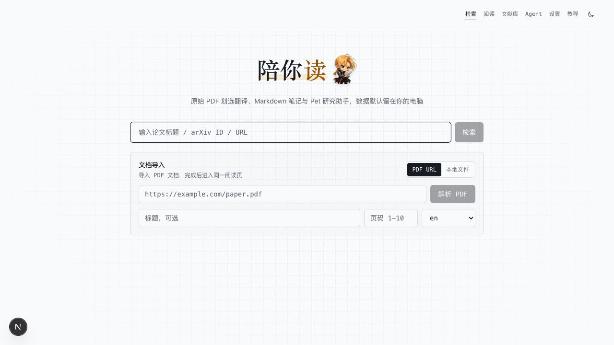
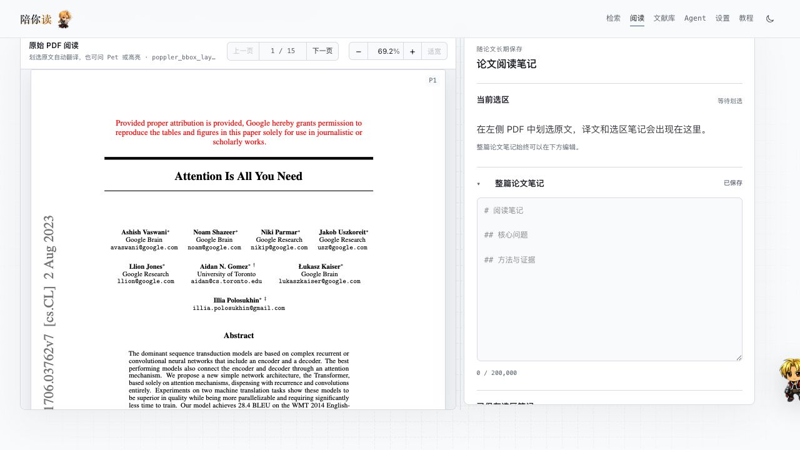
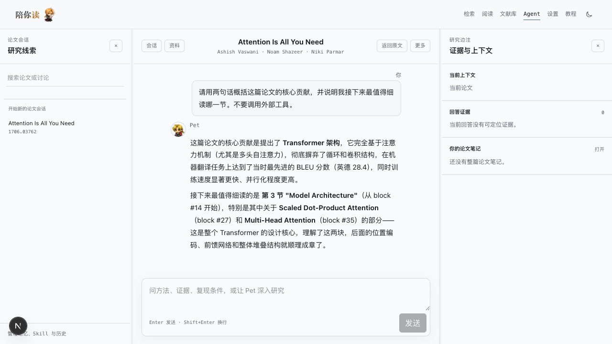

# 陪你读 / Read with you

在原始 PDF 上阅读、划选翻译、记录 Markdown 笔记，再和 Pet 一起把论文研究清楚。

[项目入口](https://readwithyou.xiaoyu666.cyou) · [部署说明](docs/deployment.md)



> 公网入口先用《Attention Is All You Need》的固定公开样例演示划选翻译、方法笔记和复现证据核对，再检查这台电脑上的本地 Core；检测成功时直接打开本地工作台，检测失败时仍可手动尝试打开，或前往 GitHub 安装、更新和启动。原始 PDF、翻译、笔记、Pet、Agent 和 API Key 始终只在用户自己的 Pet Core 中处理。

## 能做什么

- **读原始 PDF**：PDF.js canvas 保留论文原页，官方 TextLayer 负责搜索和准确划选。
- **划选即翻译**：选中英文后自动请求基础翻译，译文固定显示在右侧，不覆盖论文。
- **边读边记**：保存重要、疑问、方法、结论等语义高亮，并维护整篇论文 Markdown 笔记。
- **问 Pet**：围绕当前论文、选区和你的笔记快速提问。
- **进入 Agent 工作台**：进行长对话、方法分析、复现判断、外部检索与证据核对。
- **安装前先体验**：公网固定样例可完成一次划选、笔记和 Pet 复现核对，不调用模型，也不保存内容。
- **数据留在本机**：论文工作区可写入用户选择的本地文件夹；Provider Key 进入系统凭据库。

## 使用方式

### 1. 安装或启动本地 Core

目前公开入口提供开发者源码安装；首个 Developer ID 签名并经 Apple 公证的
`v0.1.0-beta.1` 发布后，Apple Silicon Mac 会在同一区域直接看到 DMG 下载。
启动 Core 后访问公网入口或直接打开 `127.0.0.1:8520`。Chrome 首次从公网入口
检查 Core 时可能请求本地网络访问权限；它只用于连接本机 loopback 服务。若浏览器
拦截探测，可直接使用页面上的“尝试打开本地工作台”。本地首页可输入论文标题、
arXiv ID 或 URL，确认检索候选并查看关系图谱，也可导入本地 PDF。

### 2. 在原始 PDF 中划选

左侧始终是原始 PDF。选中文字后，右侧呈现译文、语义高亮和选区笔记；整篇论文笔记会随论文长期保存。



### 3. 随时问 Pet

阅读页的 Pet 适合快速解释当前段落、核对术语或把问题带入同一论文会话。

### 4. 用 Agent 深入研究

Agent 页面采用“论文会话 / 对话 / 证据与笔记”三栏工作台。它与阅读页 Pet 共用会话，不会重复发送问题。



### 5. 保存到自己的文件夹

在“设置 → 文献与存储”选择本地文件夹。论文、PDF、翻译、笔记、标注、对话和分析结果会经过逐文件 SHA-256 校验后写入该目录。

## 安装与启动

### 普通用户：签名 macOS Beta

首个公开 Beta 面向 Apple Silicon Mac，要求 macOS 14 或更高版本。正式 Release
出现后：

1. 从公网主页或 GitHub Release 下载版本化 DMG。
2. 打开 DMG，将 `Peinidu.app` 拖入 Applications。
3. 启动“陪你读”，浏览器会打开 [http://127.0.0.1:8520](http://127.0.0.1:8520)。

下载页同时显示版本、SHA-256 和 Release notes。Actions 中
`signed=false` / `notarized=false` 的短期候选 Artifact 仅供开发验证，不是普通
用户安装包，也不应通过绕过 Gatekeeper 的方式使用。

当前尚未配置 Apple Developer ID 与公证凭据，因此 GitHub 还没有公开
`v0.1.0-beta.1`；在信任链和干净机验收完成前，主页会继续显示开发者源码安装。

### 开发者：从源码启动

当前推荐从源码启动本地 Core。它只监听 `127.0.0.1:8520`，并在同一个 origin 下提供页面、API、PDF 资产与 SSE。

环境要求：

- Python 3.11+
- Node.js 22
- Poppler（`pdfinfo`、`pdftotext`）

```bash
git clone https://github.com/xiaoyu-ops/Read_with_you.git
cd Read_with_you

python -m pip install -r backend/requirements-local-core.txt
cd frontend && npm ci && cd ..

python scripts/start_local_core_dev.py
```

不自动打开浏览器：

```bash
python scripts/start_local_core_dev.py --no-browser
```

随后访问 [http://127.0.0.1:8520](http://127.0.0.1:8520)。

### 卸载

将 `/Applications/Peinidu.app` 移到废纸篓只删除应用，不会删除论文、笔记或
Keychain 中的 Provider 凭据。本地工作数据默认位于
`~/Library/Application Support/Peinidu`。需要彻底清理时，先备份已选择的本地
文献文件夹，再由用户手动删除该目录和对应 Keychain 项；应用不会自动执行数据删除。

## 配置自己的服务

打开“设置 → 模型与翻译”填写：

- **LLM Provider**：用于 Pet、Agent、摘要与专业分析，统一经过 LiteLLM。
- **DeepLX**：用于不需要 Agent 推理的基础选区翻译。
- **MinerU**：可选，用于复杂版面或扫描 PDF 的解析兜底。

本地 Core 在 macOS 只接受 Keychain，在 Windows 只接受 Credential Manager。API 仅返回“已配置”状态与固定掩码，不回显 Key、前缀或凭据引用。

## 数据与隐私

- 公网门户首页只使用两张固定、版本化的公开论文页面图演示产品能力，再探测本地 Core 的无内容就绪状态并提供 GitHub 安装入口；演示不接收输入、不调用模型、不持久化状态。门户保留的公开学术元数据与论文关系图 API 同样不接收 PDF、翻译、笔记、问题、回答、Key 或本地文件。
- 产品默认发送固定的无内容使用事件，用于统计当天有多少人访问、检索、打开图谱或真正打开本地阅读器；事件只含 UTC 日期、每日变化的匿名 ID、平台与版本，不记录搜索词、论文 ID、页面路径、IP 或跨日用户轨迹。
- API Key 不进入浏览器存储、论文目录、portable bundle、日志、Prompt 或对话记录。
- Agent 引用你的笔记时会明确标记“你的笔记”，不会把用户判断冒充论文事实。
- 本地文件夹模式由用户主动授权；写入和恢复均校验 revision、路径与 SHA-256。

## 技术结构

| 层 | 实现 |
|---|---|
| Web | Next.js、React、Tailwind CSS、PDF.js |
| Core | FastAPI、SQLite / FTS5、Poppler |
| 翻译 | DeepLX；旧 LiteLLM 翻译路径仅作兼容 |
| Agent | 统一迭代 Agent Loop、LiteLLM、权限按 Run 暂停与恢复 |
| 提取 | ar5iv / LaTeX 优先，MinerU 可选兜底 |
| 存储 | 本机应用数据目录或用户选择的本地文件夹 |

Playwright 浏览器自动化与中文 PDF 导出都是默认关闭的可选 profile，不进入核心镜像，也不影响日常阅读、翻译和 Agent。

## 开发与验证

开发时也可以分别启动前后端：

```bash
uvicorn backend.api.main:app --reload --port 8000
cd frontend && npm run dev
```

主要验证命令：

```bash
python -m unittest discover backend/tests
python -m compileall -q backend scripts
cd frontend && npx tsc --noEmit
```

完整部署、安全边界和可选服务说明见 [docs/deployment.md](docs/deployment.md)。

## 当前边界

- arXiv 优先走结构化源码；扫描件需要 MinerU/OCR，无法证明准确时会明确降级。
- 公网入口可以完成论文检索、候选确认与关系图探索，但不是共享阅读后端；PDF、
  翻译、笔记、文献库、Pet 和 Agent 仍需本机 Core。门户中的 loopback 入口只有在
  `127.0.0.1:8520` 健康时才可用。
- macOS 候选现在可生成 Apple Silicon DMG、SHA-256 和 provenance，但当前仍是
  `signed=false` / `notarized=false` 的开发候选。只有受保护 Actions 完成
  Developer ID、公证、staple 和干净机验收后才会创建公开 prerelease。
- Windows 已有构建工作流，但仍需在干净 Windows 机器上完成发行验收。
